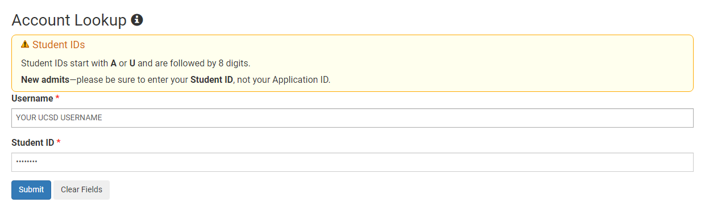
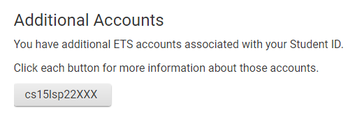
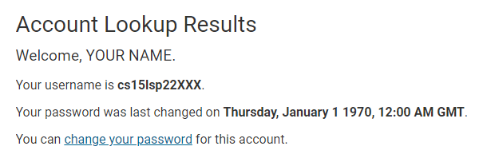
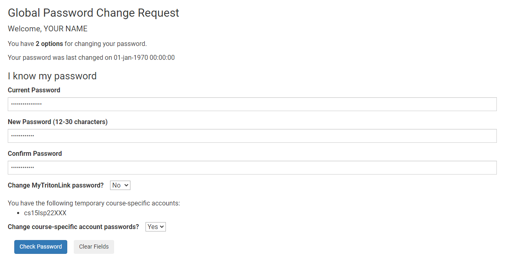
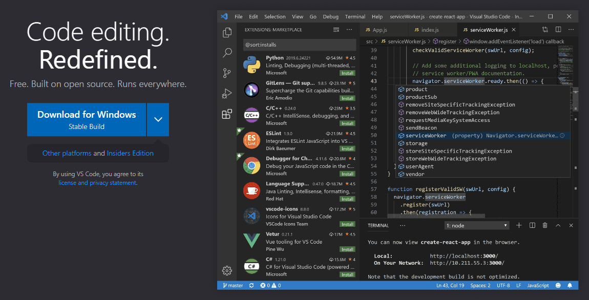
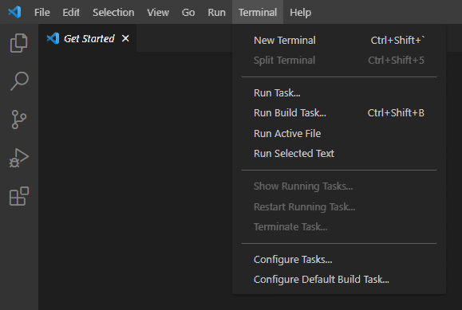
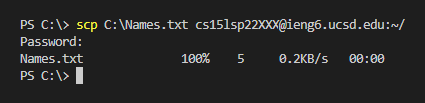
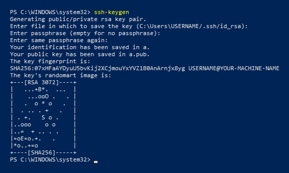
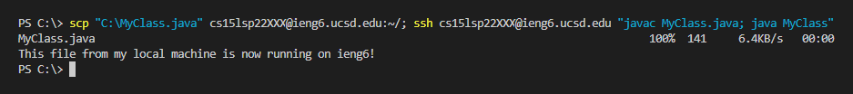

# Week 2 - Lab Report 1
This is a guide on how to access and use your course-specific account on `ieng6` from your own device.

<hr>

## Obtaining Your Course-Specific Account Login
Log into the [Account Lookup](https://sdacs.ucsd.edu/~icc/index.php) site using your UCSD username and PID, then click on the blue 'Submit' button.  
   
There should be a section near the top of the page labelled 'Additional Accounts' with a list of buttons below.  Your course-specific account name is the one following the format `cs15lsp22XXX`, keep note of this.

> ### First Time Login
> <hr>
>
> If this is your first time attempting to log into your course-specific account, the password must be set in order for you to log in.  
Click on the button with your course-specific account name on it to navigate to its account page and click on 'change your password' at the top of the page.  
  
    
Log in again with your UCSD username and PID.  You will be prompted to enter your current password, as well as a new password.  
Ensure the fields 'Change MyTritonLink password?' is set to `No` and 'Change course-specific account passwords?' is set to `Yes`.  
Press your Enter/Return key to set your password.  
    

<hr>

## Installing VS Code
Download the installer from the [Visual Studio Code website](https://code.visualstudio.com/) and run it.  
     
The install process is straightforward and should result in a working installation of VS Code on your system.  

<hr>

## Remotely Connecting
Open VS Code and open a terminal window using the keyboard shortcut `` Ctrl + ` `` or navigating to `Terminal -> New Terminal` through the top menu.  
    
In the terminal, you can access your course-specific account on `ieng6` using the following command:
```
ssh {CSA}@ieng6.ucsd.edu
```
In the command above, replace `{CSA}` with your course-specific account name from [Obtaining Your Course-Specific Account Login](#obtaining-your-course-specific-account-login).

> ### First Time Login
> <hr>
>
> If this is your first time attempting to remotely connect to `ieng6`, you may be prompted with the following:
> ```
> The authenticity of host 'ieng6.ucsd.edu (XXX.XXX.XXX.XXX)' can't be established.
> RSA key fingerprint is SHA256:ksruYwhnYH+sySHnHAtLUHngrPEyZTDl/1x99wUQcec.
> Are you sure you want to continue connecting (yes/no/[fingerprint])?
> ```
> For simplicity's sake, type `yes` and press enter.  

When prompted, enter the password for your course-specific account and press enter.<sup>[[1](#sup1sup-characters-will-not-appear-while-typing-but-you-are-still-entering-your-password)]</sup>  
You should be met with the following:
```
Hello cs15lsp22XXX, you are currently logged into ieng6-20X.ucsd.edu

You are using 0% CPU on this system

Cluster Status 
Hostname     Time    #Users  Load  Averages  
ieng6-201   XX:XX:XX   XX  X.XX,  X.XX,  X.XX
ieng6-202   XX:XX:XX   XX  X.XX,  X.XX,  X.XX
ieng6-203   XX:XX:XX   XX  X.XX,  X.XX,  X.XX

 
XXX XXX XX, XXXX XX:XXXX - Prepping cs15lsp22
[cs15lsp22XXX@ieng6-20X]:~:XXX$ 
```
Congratulations, you have successfully remotely connected to your course-specific account on `ieng6`.

<hr>

## Trying Some Commands
To preface, it is important to note that `ieng6` is running a distribution of the Linux operating system called CentOS.  
You will be interacting with Linux through the command line using various commands to perform tasks.

> ### Useful Linux Commands
> <hr>
> 
> #### **`cd <path>?`**
> The `cd` command is used to **c**hange the **d**irectory from which you're currently working in.  
> The `<path>?` argument is optional and represents a path to the directory you want to navigate to.  
>
> #### Examples
> * `cd` : Sets the working directory to your home directory.
> * `cd /` : Sets the working directory to the root directory.
> * `cd ~/..` : Sets the working directory to the parent directory of your home directory.
> 
> <hr>
>
> #### **`ls <options>? <path>?`**
> The `ls` command is used to list the contents of a directory.  
> The `<options>?` argument is optional and can be used to augment the output of the command.  
> The `<path>?` argument is optional and represents the path to a directory to have its contents listed.
>
> #### Examples
> * `ls` : Lists the contents of the working directory.
> * `ls ~/..` : Lists the contents of the parent of your home directory.
> * `ls -lat /` : Lists the contents of the root directory with **l**ong format, **a**ll files, and sorting by **t**ime.  
>    
> 
> <hr>
>
> #### **`pwd`**
> The `pwd` command is used to print the working directory.  
>
> #### Examples
> * `cd; pwd` : Prints the path to your home directory.

<hr>

## Moving Files with `scp`
Throughout your computer science career, there will come a time where you will need to copy a file from your machine to a server.  
You can copy files to a remote server using the `scp` command **on your own machine**.
> ### Command Format for `scp` 
> <hr>
> 
> #### **`scp <target_file>+ <user>@<host>:<destination_path>`**
> The `scp` command is used to **s**ecurely **c**o**p**y files from the local machine to a remote server.  
> The `<target_file>+` argument represents the path to the file or files you want to copy on your local machine.  
> The `<user>` argument represents the name of the user to log in as on the remote server.  
> The `<host>` argument represents the host server to connect to.  
> The `<destination_path>` argument represents the path to the directory on the remote server to copy your file into.
> #### Examples
> * `scp 'C:\Names.txt' cs15lsp22XXX@ieng6.ucsd.edu:~/` : Copies `Names.txt` from the `C:\` directory on your local machine to the home directory of `cs15lsp22XXX` on `ieng6`.
> * `scp 'C:\Dogs.txt' 'C:\Cats.txt' cs15lsp22XXX@ieng6.ucsd.edu:~/Animals` : Copies `Dogs.txt` and `Cats.txt` from the `C:\` directory on your local machine to the `~/Animals` directory on `ieng6`.  

In this course, you will be transferring files from your local machine to `ieng6`.  
Following the format above, the `<user>` argument would be your course-specific account name and `<host>` would be `ieng6@ucsd.edu`.  
The process of copying files to `ieng6` looks like this:  
  
Notice that each use of the `scp` command requires you to enter the password to your course-specific account; this is mitigated by [Setting an SSH Key](#setting-an-ssh-key).

<hr>

## Setting an SSH Key
SSH keys are a useful tool for skipping the password prompt when using the `ssh` and `scp` command.  
You can use the `ssh-keygen` command in a terminal on your local machine to generate a public and private RSA key pair to accomplish this.  
> ### Windows Users
> <hr>
>
> If you are running Windows on your local machine, use `ssh-keygen -t ed25519` instead.  
> You may also have to be running a PowerShell terminal as an Administrator.

When prompted where to save the key, you can press enter to save it to an `.ssh` folder in your home directory.  
**When prompted to enter a passphrase, just press enter.**  
Your terminal output should look like this:  
  
> ### Windows Users
> <hr>
>
> On Windows, you will have to register your SSH keys with the `ssh-agent` service.  
> This can be done by running the following commands in a terminal window **as an Administrator**:
> ```
> Get-Service ssh-agent | Set-Service -StartupType Manual
> Start-Service ssh-agent
> ssh-add ~\.ssh\id_rsa
> ```
> If you saved your RSA key pair somewhere else, replace `~\.ssh\id_rsa` with the path to your private key.

Now copy the public key to the server.  
To do so, use the `ssh` command to [Remotely Connect](#remotely-connecting) to `ieng6`.  
Create an `.ssh` directory in your home directory and then exit with the following commands:
```
mkdir .ssh
exit
```
From your local machine, use the `scp` command to copy the public RSA key to your `.ssh` folder:
```
scp ~\.ssh\id_rsa.pub cs15lsp22XXX@ieng6.ucsd.edu:~/.ssh
```
Once the public key has been copied over, you should no longer be prompted to enter your pasword when using the `ssh` or `scp` command.

<hr>

## Optimizing Remote Running
THroughout the course of a programming project, you may need to copy files and log in remotely hundreds of times, and this takes time.  
Luckily, there are a few shortcuts you can take to minimize repitition and optimize your workflow.  
> ### Strategies for Optimizing Remote Running
> <hr>
> 
> #### **Running Multiple Commands at Once**
> From both your local machine and the remote server, you can use the semicolon (`;`) to separate commands and have them run consecutively.  
> This is useful for performing many actions in order without having to actively monitor the terminal window.
> <hr>
>
> #### **Running Commands With `ssh`**
> When [Remotely Connecting](#remotely-connecting) to `ieng6`, you can insert commands to be ran on the remote server as an argument at the end of the command in double quotes.  
> This combined with the last strategy is useful for completing remote tasks in one command rather than multiple.
> <hr>
>
> #### **Repeating Previous Commands**
> In your terminal, you can use the up arrow key to quickly recall previous commands.  
> This is useful for cases where the same set of commands need to be rerun multiple times, most likely between changes made to a file.

These strategies used together can be used to copy over source code to the server, compile, and execute, all in one go!  
  

<hr>

#### <sup>1</sup> Characters will not appear while typing, but you are still entering your password.