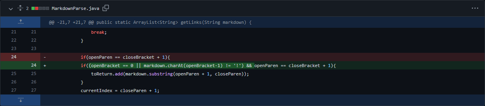

# Week 4 - Lab Report 2
This lab report aims to document the process of developing `MarkdownParse.java` using the incremental development process to quickly find and resolve bugs.  
There are three significant code changes which were made to refine the link parser in order to more accurately capture links and not crash.  

## Code Change 1
  
The file containing the failure-inducing input that this code change fixes can be found [here](https://github.com/wow13524/markdown-parser/blob/main/test-file.md).  
### Symptom in Output
```
Exception in thread "main" java.lang.OutOfMemoryError: Java heap space
        at java.base/java.util.Arrays.copyOf(Arrays.java:3512)
        at java.base/java.util.Arrays.copyOf(Arrays.java:3481)
        at java.base/java.util.ArrayList.grow(ArrayList.java:237)
        at java.base/java.util.ArrayList.grow(ArrayList.java:244)
        at java.base/java.util.ArrayList.add(ArrayList.java:454)
        at java.base/java.util.ArrayList.add(ArrayList.java:467)
        at MarkdownParse.getLinks(MarkdownParse.java:19)
        at MarkdownParse.main(MarkdownParse.java:30)
```
### Explanation
The linked file contains an empty line at the end of the file.  Because the index of the last closing parenthesis is not at the end of the string, the surrounding while loop is never broken.  Then, `closeParen` is equal to `-1` and it loops from the beginning of the file again.

## Code Change 2
  
The file containing the failure-inducing input that this code change fixes can be found [here](https://github.com/wow13524/markdown-parser/blob/main/test-file.md).  
### Symptom in Output
```
[https://something.com, some-thing.html, breaking-test.html]
```
### Explanation
The linked file contains an invalid link in markdown with text between the right bracket and the left parenthesis.  This does not generate a valid link in markdown, but the code does not have any checks to verify that the left parenthesis comes right after the right bracket.  The code change accounts for this.

## Code Change 3
  
The file containing the failure-inducing input that this code change fixes can be found [here](https://github.com/wow13524/markdown-parser/blob/main/test-file.md).  
### Symptom in Output
```
[https://something.com, some-thing.html, this-is-an-image.jpg]
```
### Explanation
The linked file contains an image in markdown which has a similar format to links.  The code does not check to make sure an exclamation mark is not preceeding the left bracket which normally signifies an image.  The code change accounts for this.