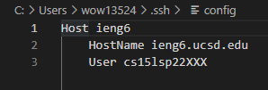
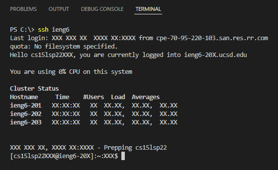
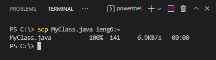
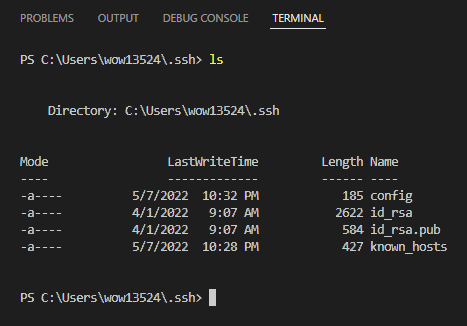
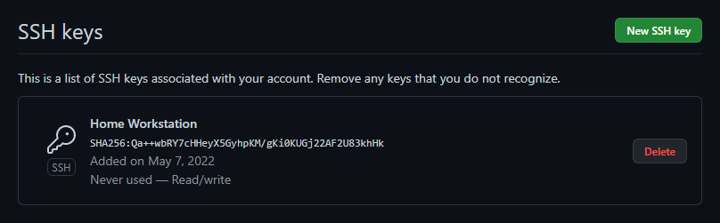
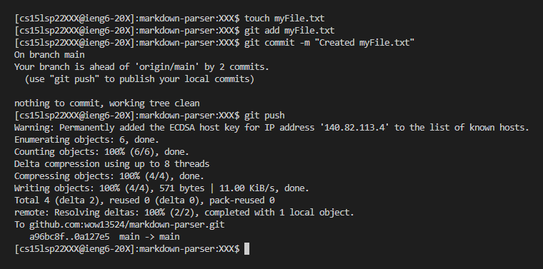
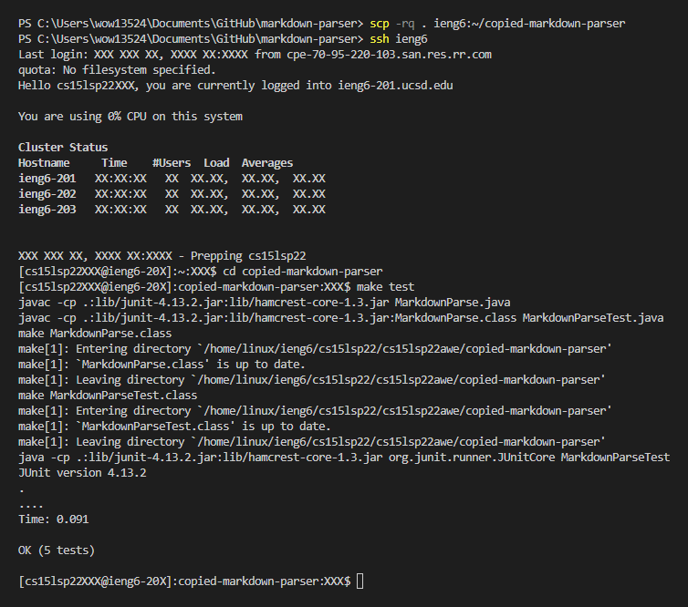
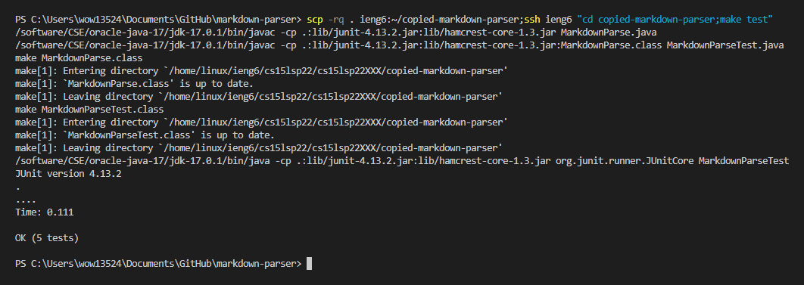

# Week 4 - Lab Report 2
This lab report aims to document the process and results of **Streamlining `ssh` Configuration**, **Setting Up Github Access from `ieng6`**, and **Copying Whole Directories with `scp -r`**.

## Streamlining `ssh` Configuration
The `.ssh/config` file was created with the following contents:  
  
I can now log into `ieng6` using the `ieng6` alias:  
  
I can even copy files using the new alias:  
  

## Setting Up Github Access from `ieng6`
A copy of the public and private key are stored on my own computer while a copy of the public key is stored on my Github account:  
  
  
Github access has also been set up on `ieng6` and changes can be pushed:  
  
The commit can be found [here](https://github.com/wow13524/markdown-parser/commit/9ccd781c747b5a66fdc3d37a33b059bc9dcc3639)!

## Copying Whole Directories with `scp -r`
I can use `scp -r` to recursively copy my copy of `markdown-parse` to my `ieng6` account and then run the tests:
  
This can be done in one line as well:  
  