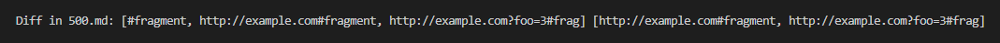
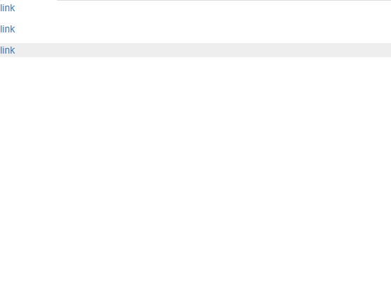
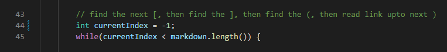
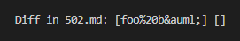

# Week 10 - Lab Report 5
This lab report aims to showcase the difference in implementation between my `markdown-parser` and the implementation provided for lab 9.

## Methods
I wrote a PowerShell to compare the outputs between runs from my implementation and the one provided for lab 9.
```
$markdownParserDirs = "~\Documents\GitHub\markdown-parser-shared","~\Documents\GitHub\markdown-parser"
foreach($dir in $markdownParserDirs){ #Compile MarkdownParse.java for all versions
	cd $dir
	javac MarkdownParse.java
}
foreach($file in Get-ChildItem "$($markdownParserDirs[0])\test-files"){
	$outputs = @()
	foreach($dir in $markdownParserDirs){ #Adds each version's output to $outputs
		cd $dir
		$outputs += java MarkdownParse $file.FullName
	}
	for($i=1;$i -lt $outputs.Count;$i++){ #Compares all outputs and prints if diff
		if(-Not $outputs[$i].equals($outputs[$i-1])){
			Write-Host "Diff in ${file}: $outputs"
			break
		}
	}
}
```
Of the 31 test files with differences in output, I will be analyzing `500.md` and `502.md`.

## Differences in `500.md`
The test file can be found [here](https://github.com/nidhidhamnani/markdown-parser/blob/main/test-files/500.md).  
Based on the [CommonMark demo site](https://spec.commonmark.org/dingus/), the implementation provided for lab 9 is correct.  
Provided implementation vs. my implementation's output:  
  
CommonMark demo site rendering:  
  
The bug that causes this difference in output occurs where my implementation searches for the first open bracket.  
I had `currentIndex` set to `0` but the method I wrote to find the next open bracket that was unescaped and outside of inline code would start indexing at `1`.  
All I had to do was initialize `currentIndex` with the value of `-1` and it worked perfectly afterwards.  
This bug only affected files that started with a link.  
  

## Differences in `502.md`
The test file can be found [here](https://github.com/nidhidhamnani/markdown-parser/blob/main/test-files/502.md).  
Based on the [CommonMark demo site](https://spec.commonmark.org/dingus/), the implementation provided for lab 9 is correct.  
Provided implementation vs. my implementation's output:  
  
CommonMark demo site rendering:  
  
The bug that causes this difference in output occurs where my implementation searches for the first open bracket.  
I had `currentIndex` set to `0` but the method I wrote to find the next open bracket that was unescaped and outside of inline code would start indexing at `1`.  
All I had to do was initialize `currentIndex` with the value of `-1` and it worked perfectly afterwards.  
This bug only affected files that started with a link.  
  

## Conclusion
Making the fixes in my code that caused the differences in output reduced the number of differences in output from 31 to 21.  
There is still a lot to work on, but it's a step in the right direction.